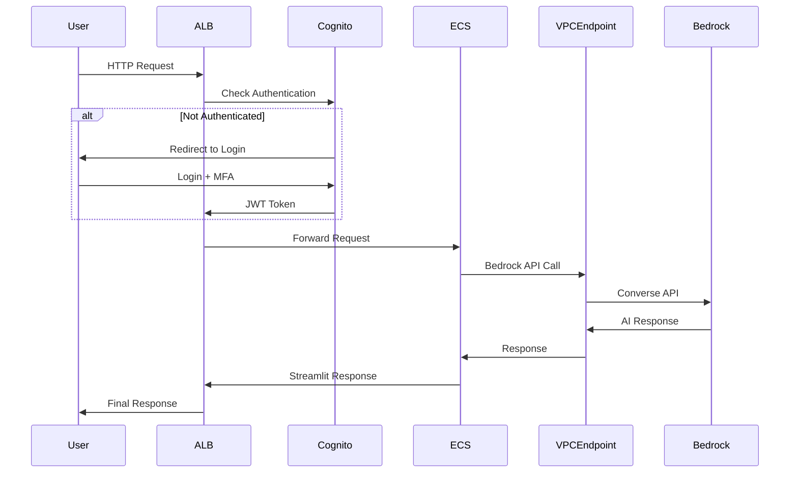

# Secure Bedrock Chatbot - Complete Architecture Documentation

## Table of Contents
1. [Executive Summary](#executive-summary)
2. [Architecture Overview](#architecture-overview)
3. [Service Components](#service-components)
4. [Security Implementation](#security-implementation)
5. [Network Architecture](#network-architecture)
6. [Execution Flow](#execution-flow)
7. [Deployment Pipeline](#deployment-pipeline)
8. [Monitoring & Logging](#monitoring--logging)
9. [Cost Analysis](#cost-analysis)
10. [Troubleshooting Guide](#troubleshooting-guide)

---

## Executive Summary

The Secure Bedrock Chatbot is an enterprise-grade conversational AI solution built on AWS infrastructure. It leverages Amazon Bedrock's Claude Sonnet 4 model with comprehensive security controls including user authentication, network isolation, and private service communication.

### Key Features
- **AI Model**: Claude Sonnet 4 via Amazon Bedrock
- **Authentication**: AWS Cognito with MFA
- **Security**: Private subnets, VPC endpoints, IAM controls
- **Scalability**: ECS Fargate with auto-scaling
- **CI/CD**: GitHub Actions automated deployment
- **Monitoring**: CloudWatch logs and metrics

---

## Architecture Overview

```
┌─────────────────────────────────────────────────────────────────┐
│                        INTERNET                                 │
└─────────────────────┬───────────────────────────────────────────┘
                      │
┌─────────────────────▼───────────────────────────────────────────┐
│                   Route 53 (Optional)                          │
└─────────────────────┬───────────────────────────────────────────┘
                      │
┌─────────────────────▼───────────────────────────────────────────┐
│                APPLICATION LOAD BALANCER                       │
│                    (Public Subnets)                           │
│  ┌─────────────────┐              ┌─────────────────┐         │
│  │   AZ-1a         │              │   AZ-1b         │         │
│  │ 10.0.1.0/24     │              │ 10.0.2.0/24     │         │
│  └─────────────────┘              └─────────────────┘         │
└─────────────────────┬───────────────────────────────────────────┘
                      │
┌─────────────────────▼───────────────────────────────────────────┐
│                  COGNITO AUTHENTICATION                        │
│                     (User Pool)                               │
└─────────────────────┬───────────────────────────────────────────┘
                      │
┌─────────────────────▼───────────────────────────────────────────┐
│                    ECS FARGATE                                 │
│                  (Private Subnets)                            │
│  ┌─────────────────┐              ┌─────────────────┐         │
│  │   AZ-1a         │              │   AZ-1b         │         │
│  │ 10.0.3.0/24     │              │ 10.0.4.0/24     │         │
│  │ ┌─────────────┐ │              │ ┌─────────────┐ │         │
│  │ │ Streamlit   │ │              │ │ Streamlit   │ │         │
│  │ │ Container   │ │              │ │ Container   │ │         │
│  │ └─────────────┘ │              │ └─────────────┘ │         │
│  └─────────────────┘              └─────────────────┘         │
└─────────────────────┬───────────────────────────────────────────┘
                      │
┌─────────────────────▼───────────────────────────────────────────┐
│                   VPC ENDPOINT                                 │
│                 (Interface Endpoint)                           │
└─────────────────────┬───────────────────────────────────────────┘
                      │
┌─────────────────────▼───────────────────────────────────────────┐
│                 AMAZON BEDROCK                                 │
│              (Claude Sonnet 4)                                │
└─────────────────────────────────────────────────────────────────┘
```

---

## Service Components

### 1. Amazon VPC (Virtual Private Cloud)
**Purpose**: Provides isolated network environment for all resources

**Configuration**:
- **CIDR Block**: 10.0.0.0/16
- **Availability Zones**: 2 (us-west-2a, us-west-2b)
- **DNS Support**: Enabled
- **DNS Hostnames**: Enabled

**Subnets**:
- **Public Subnets**: 10.0.1.0/24, 10.0.2.0/24 (ALB only)
- **Private Subnets**: 10.0.3.0/24, 10.0.4.0/24 (ECS tasks)

### 2. Application Load Balancer (ALB)
**Purpose**: Distributes incoming traffic and handles authentication

**Features**:
- **Type**: Application Load Balancer
- **Scheme**: Internet-facing
- **Protocol**: HTTP (Port 80)
- **Health Checks**: Custom endpoint /?health=check
- **Integration**: Cognito authentication

**Security Groups**:
```
Inbound Rules:
- Port 80 (HTTP) from 0.0.0.0/0
Outbound Rules:
- All traffic to 0.0.0.0/0
```

### 3. AWS Cognito
**Purpose**: User authentication and authorization

**User Pool Configuration**:
- **MFA**: Required (TOTP)
- **Password Policy**: 
  - Minimum 12 characters
  - Requires uppercase, lowercase, numbers, symbols
- **Account Recovery**: Email-based
- **OAuth Flows**: Authorization code grant

**User Pool Client**:
- **Client Type**: Confidential (with secret)
- **OAuth Scopes**: email, openid, profile
- **Callback URLs**: ALB OAuth endpoint
- **Supported Identity Providers**: Cognito

### 4. Amazon ECS (Elastic Container Service)
**Purpose**: Container orchestration for Streamlit application

**Cluster Configuration**:
- **Launch Type**: Fargate
- **CPU**: 512 units (0.5 vCPU)
- **Memory**: 1024 MB (1 GB)
- **Network Mode**: awsvpc
- **Platform Version**: Latest

**Task Definition**:
```json
{
  "family": "bedrock-chatbot-task",
  "networkMode": "awsvpc",
  "requiresCompatibilities": ["FARGATE"],
  "cpu": "512",
  "memory": "1024",
  "executionRoleArn": "arn:aws:iam::account:role/ecsTaskExecutionRole",
  "taskRoleArn": "arn:aws:iam::account:role/bedrockTaskRole"
}
```

**Service Configuration**:
- **Desired Count**: 1
- **Deployment Type**: Rolling update
- **Health Check Grace Period**: 60 seconds
- **Load Balancer Integration**: Target group attachment

### 5. Amazon ECR (Elastic Container Registry)
**Purpose**: Docker image repository

**Configuration**:
- **Repository Name**: streamlit-bedrock-chatbot
- **Image Tag Mutability**: Mutable
- **Scan on Push**: Enabled
- **Encryption**: AES256

### 6. Amazon Bedrock
**Purpose**: AI/ML service providing Claude Sonnet 4 model

**Model Configuration**:
- **Model ID**: us.anthropic.claude-sonnet-4-20250514-v1:0 (Inference Profile)
- **API**: Converse API
- **Parameters**:
  - Temperature: 0.9
  - Max Tokens: 2000
  - Top P: 1.0

**Access Method**: VPC Endpoint (Private connectivity)

### 7. VPC Endpoints
**Purpose**: Private connectivity to AWS services

**Bedrock VPC Endpoint**:
- **Service**: com.amazonaws.us-west-2.bedrock-runtime
- **Type**: Interface endpoint
- **Subnets**: Private subnets
- **Security Groups**: Restricted to ECS tasks
- **Private DNS**: Enabled

### 8. NAT Gateway
**Purpose**: Outbound internet access for private subnets

**Configuration**:
- **Count**: 2 (one per AZ)
- **Elastic IPs**: Allocated automatically
- **Bandwidth**: Up to 45 Gbps
- **Availability**: 99.99% SLA

### 9. Internet Gateway
**Purpose**: Internet connectivity for public subnets

**Configuration**:
- **Attachment**: VPC
- **Route Tables**: Public subnet routing

---

## Security Implementation

### 1. Network Security

**Network Segmentation**:
- **Public Subnets**: ALB only (no compute resources)
- **Private Subnets**: ECS tasks (no direct internet access)
- **Isolated Communication**: VPC endpoints for AWS services

**Security Groups**:

**ALB Security Group**:
```
Name: bedrock_alb_sg
Inbound:
  - Port 80, Protocol TCP, Source 0.0.0.0/0
Outbound:
  - All traffic, All protocols, Destination 0.0.0.0/0
```

**ECS Security Group**:
```
Name: bedrock_ecs_sg
Inbound:
  - Port 8501, Protocol TCP, Source ALB Security Group
Outbound:
  - All traffic, All protocols, Destination 0.0.0.0/0
```

**VPC Endpoint Security Group**:
```
Name: bedrock-vpc-endpoint-sg
Inbound:
  - Port 443, Protocol TCP, Source ECS Security Group
Outbound:
  - All traffic, All protocols, Destination 0.0.0.0/0
```

### 2. Identity and Access Management (IAM)

**ECS Task Execution Role**:
```json
{
  "Version": "2012-10-17",
  "Statement": [
    {
      "Effect": "Allow",
      "Principal": {
        "Service": "ecs-tasks.amazonaws.com"
      },
      "Action": "sts:AssumeRole"
    }
  ]
}
```

**Attached Policies**:
- AmazonECSTaskExecutionRolePolicy (AWS Managed)

**ECS Task Role (Bedrock Access)**:
```json
{
  "Version": "2012-10-17",
  "Statement": [
    {
      "Effect": "Allow",
      "Action": [
        "bedrock:InvokeModel",
        "bedrock:Converse",
        "bedrock:ListModels",
        "bedrock:GetModel",
        "bedrock:DescribeModel",
        "bedrock:ListFoundationModels"
      ],
      "Resource": "*"
    }
  ]
}
```

### 3. Authentication Flow

```
1. User → ALB (HTTP Request)
2. ALB → Cognito (Authentication Check)
3. Cognito → User (Login Page)
4. User → Cognito (Credentials + MFA)
5. Cognito → ALB (JWT Token)
6. ALB → ECS (Authenticated Request)
7. ECS → User (Application Response)
```

---

## Network Architecture

### 1. VPC Design

**Address Space**: 10.0.0.0/16 (65,536 IP addresses)

**Subnet Allocation**:
```
Public Subnet 1:  10.0.1.0/24 (256 IPs) - us-west-2a
Public Subnet 2:  10.0.2.0/24 (256 IPs) - us-west-2b
Private Subnet 1: 10.0.3.0/24 (256 IPs) - us-west-2a
Private Subnet 2: 10.0.4.0/24 (256 IPs) - us-west-2b
```

### 2. Routing Tables

**Public Route Table**:
```
Destination: 10.0.0.0/16 → Target: Local
Destination: 0.0.0.0/0   → Target: Internet Gateway
```

**Private Route Tables** (per AZ):
```
Destination: 10.0.0.0/16 → Target: Local
Destination: 0.0.0.0/0   → Target: NAT Gateway (AZ-specific)
```

### 3. DNS Resolution

**Internal DNS**:
- VPC DNS resolution: Enabled
- VPC DNS hostnames: Enabled
- Private hosted zones: Not required

**External DNS**:
- ALB DNS name: auto-generated
- Custom domain: Optional (not implemented)

---

## Execution Flow

### 1. User Request Flow



### 2. Application Startup Flow

```
1. ECS Service starts task
2. Task pulls image from ECR
3. Container starts Streamlit app
4. Health check endpoint becomes available
5. ALB registers healthy target
6. Service becomes available for traffic
```

### 3. Authentication Flow Detail

```
1. User accesses ALB URL
2. ALB checks for valid JWT token
3. If no token, redirect to Cognito hosted UI
4. User enters email/password
5. Cognito validates credentials
6. If first login, user sets up MFA (TOTP)
7. User enters MFA code
8. Cognito issues JWT token
9. Browser redirected back to ALB with token
10. ALB validates JWT and forwards to ECS
```

### 4. AI Conversation Flow

```
1. User submits question via Streamlit UI
2. Streamlit app calls query_bedrock() function
3. Function creates Bedrock client
4. API call routed through VPC endpoint
5. Bedrock processes request with Claude Sonnet 4
6. Response returned through VPC endpoint
7. Streamlit displays response to user
```

---

## Deployment Pipeline

### 1. GitHub Actions Workflow

**Trigger Events**:
- Push to main/master branch
- Pull request to main/master branch

**Pipeline Stages**:

```yaml
1. Checkout Code
   - actions/checkout@v4

2. Configure AWS Credentials
   - aws-actions/configure-aws-credentials@v4
   - Uses GitHub secrets for AWS access

3. Setup Terraform
   - hashicorp/setup-terraform@v3
   - Version 1.5.0

4. Terraform Operations
   - terraform init
   - terraform plan
   - terraform apply (main branch only)

5. Docker Operations
   - Login to ECR
   - Build Docker image
   - Tag with commit SHA and latest
   - Push to ECR

6. ECS Deployment
   - Update ECS service
   - Force new deployment
   - Wait for service stability

7. Output Results
   - Display application URL
   - Show Cognito User Pool ID
```

### 2. Infrastructure as Code

**Terraform Modules**:
- **VPC Module**: Network infrastructure
- **Security Module**: IAM roles and policies
- **Compute Module**: ECS cluster and services
- **Storage Module**: ECR repository
- **Authentication Module**: Cognito configuration

**State Management**:
- Backend: S3 bucket (configured separately)
- State locking: DynamoDB table
- Encryption: AES256

### 3. Container Build Process

```dockerfile
FROM python:3.11-slim
WORKDIR /app
RUN apt-get update && apt-get install -y curl
COPY requirements.txt .
RUN pip install --no-cache-dir -r requirements.txt
COPY . .
EXPOSE 8501
HEALTHCHECK --interval=30s --timeout=10s --start-period=5s --retries=3 \
    CMD curl -f http://localhost:8501/?health=check || exit 1
CMD ["streamlit", "run", "app.py", "--server.port=8501", "--server.address=0.0.0.0", "--server.headless=true"]
```

---

## Monitoring & Logging

### 1. CloudWatch Logs

**Log Groups**:
- `/aws/ecs/bedrock-chatbot`: Application logs
- `/aws/lambda/cognito-triggers`: Authentication logs (if triggers added)
- `/aws/apigateway/bedrock`: API access logs (if API Gateway added)

**Log Retention**: 30 days (configurable)

### 2. CloudWatch Metrics

**ECS Metrics**:
- CPUUtilization
- MemoryUtilization
- TaskCount
- ServiceEvents

**ALB Metrics**:
- RequestCount
- TargetResponseTime
- HTTPCode_Target_2XX_Count
- HTTPCode_Target_4XX_Count
- HTTPCode_Target_5XX_Count

**Bedrock Metrics**:
- InvocationCount
- InvocationLatency
- InvocationErrors
- TokenCount

### 3. Health Checks

**ALB Health Check**:
- Path: /?health=check
- Interval: 30 seconds
- Timeout: 5 seconds
- Healthy threshold: 2
- Unhealthy threshold: 2

**Container Health Check**:
- Command: curl -f http://localhost:8501/?health=check
- Interval: 30 seconds
- Timeout: 10 seconds
- Retries: 3

---

## Cost Analysis

### 1. Monthly Cost Breakdown (Estimated)

**Compute Services**:
- ECS Fargate (0.5 vCPU, 1GB): ~$15/month
- NAT Gateway (2 instances): ~$90/month
- Application Load Balancer: ~$20/month

**Storage Services**:
- ECR Storage (1GB): ~$0.10/month
- CloudWatch Logs (10GB): ~$5/month

**AI Services**:
- Bedrock Claude Sonnet 4: Variable (pay-per-use)
  - Input tokens: $0.003 per 1K tokens
  - Output tokens: $0.015 per 1K tokens

**Authentication**:
- Cognito User Pool: Free tier (50,000 MAU)
- Additional users: $0.0055 per MAU

**Network**:
- Data Transfer: $0.09 per GB (outbound)
- VPC Endpoints: ~$22/month

**Total Estimated Monthly Cost**: ~$150-200 (excluding Bedrock usage)

### 2. Cost Optimization Strategies

**Immediate Optimizations**:
- Use single NAT Gateway for development
- Implement CloudWatch log retention policies
- Use Spot instances for non-production

**Long-term Optimizations**:
- Reserved capacity for predictable workloads
- S3 storage for static assets
- CloudFront for content delivery

---

## Troubleshooting Guide

### 1. Common Issues

**ECS Tasks Not Starting**:
```bash
# Check service events
aws ecs describe-services --cluster bedrock-ecs-cluster --services bedrock-chatbot-service

# Check task definition
aws ecs describe-task-definition --task-definition bedrock-chatbot-task

# View task logs
aws logs tail /aws/ecs/bedrock-chatbot --follow
```

**Authentication Issues**:
```bash
# Verify Cognito configuration
aws cognito-idp describe-user-pool --user-pool-id <pool-id>

# Check user status
aws cognito-idp admin-get-user --user-pool-id <pool-id> --username <email>

# Reset user password
aws cognito-idp admin-set-user-password --user-pool-id <pool-id> --username <email> --password <new-password> --permanent
```

**Bedrock Access Issues**:
```bash
# Test Bedrock access
aws bedrock-runtime converse --model-id us.anthropic.claude-sonnet-4-20250514-v1:0 --messages '[{"role":"user","content":[{"text":"Hello"}]}]'

# Check IAM permissions
aws iam get-role-policy --role-name bedrockTaskRole --policy-name BedrockAccessPolicy

# Verify VPC endpoint
aws ec2 describe-vpc-endpoints --filters Name=service-name,Values=com.amazonaws.us-west-2.bedrock-runtime
```

### 2. Monitoring Commands

**Health Checks**:
```bash
# ALB target health
aws elbv2 describe-target-health --target-group-arn <target-group-arn>

# ECS service status
aws ecs describe-services --cluster bedrock-ecs-cluster --services bedrock-chatbot-service --query 'services[0].{Status:status,Running:runningCount,Desired:desiredCount}'

# Container logs
aws logs get-log-events --log-group-name /aws/ecs/bedrock-chatbot --log-stream-name <stream-name>
```

### 3. Performance Tuning

**ECS Optimization**:
- Increase CPU/Memory if response times are slow
- Enable auto-scaling based on CPU/Memory metrics
- Use multiple tasks for high availability

**Network Optimization**:
- Monitor VPC endpoint usage
- Consider VPC peering for multi-region deployments
- Implement CloudFront for static content

---

## Conclusion

This architecture provides a secure, scalable, and maintainable chatbot solution with enterprise-grade security controls. The implementation follows AWS best practices for network isolation, authentication, and service communication while maintaining cost efficiency and operational simplicity.

**Key Benefits**:
- **Security**: Multi-layered security with authentication, network isolation, and private service communication
- **Scalability**: Auto-scaling ECS services with load balancing
- **Maintainability**: Infrastructure as Code with automated CI/CD
- **Cost-Effective**: Pay-per-use model with optimization opportunities
- **Compliance**: Suitable for enterprise environments with strict security requirements

**Next Steps**:
1. Implement monitoring dashboards
2. Add automated backup strategies
3. Enhance logging and alerting
4. Consider multi-region deployment for disaster recovery
5. Implement advanced security features (WAF, GuardDuty)

---

*Document Version: 1.0*  
*Last Updated: September 30, 2025*  
*Author: AWS Solutions Architecture Team*
